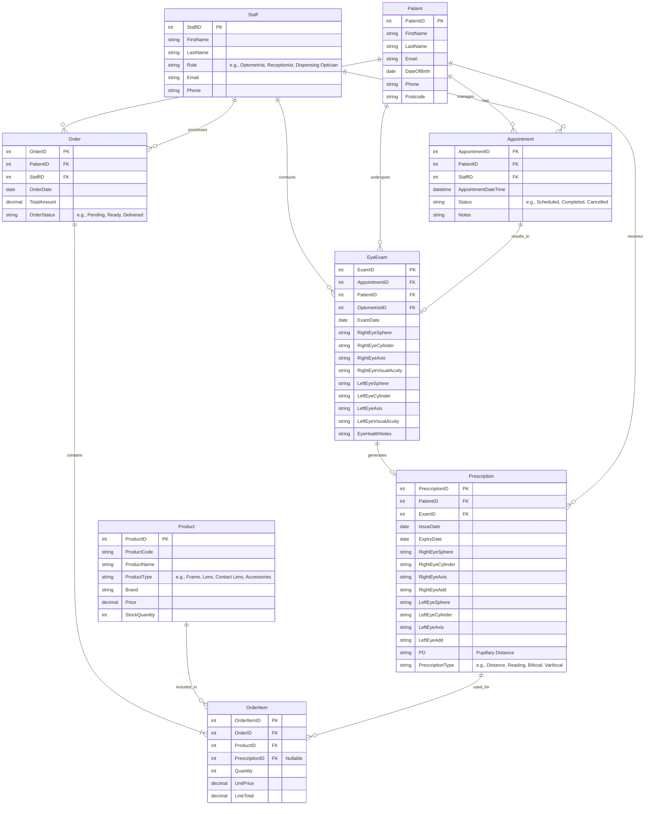

# Optical Clinical Database - Logical Data Model

This document outlines the logical database model for an optical clinical system.

## Entity-Relationship Diagram

## Entity Descriptions

### 1. Patient
Represents the customers or patients visiting the clinic. Based on the provided customer data.
- **Attributes:**
  - `PatientID` (Primary Key, int)
  - `FirstName` (string)
  - `LastName` (string)
  - `Email` (string)
  - `DateOfBirth` (date)
  - `Phone` (string)
  - `Postcode` (string)

### 2. Staff
Represents the employees of the clinic, including optometrists, dispensing opticians, and receptionists.
- **Attributes:**
  - `StaffID` (Primary Key, int)
  - `FirstName` (string)
  - `LastName` (string)
  - `Role` (string)
  - `Email` (string)
  - `Phone` (string)

### 3. Appointment
Records scheduled visits for patients to see a staff member.
- **Attributes:**
  - `AppointmentID` (Primary Key, int)
  - `PatientID` (Foreign Key -> Patient.PatientID)
  - `StaffID` (Foreign Key -> Staff.StaffID)
  - `AppointmentDateTime` (datetime)
  - `Status` (string)
  - `Notes` (string)

### 4. EyeExam
Captures the clinical findings of an eye examination.
- **Attributes:**
  - `ExamID` (Primary Key, int)
  - `AppointmentID` (Foreign Key -> Appointment.AppointmentID)
  - `PatientID` (Foreign Key -> Patient.PatientID)
  - `OptometristID` (Foreign Key -> Staff.StaffID)
  - `ExamDate` (date)
  - `RightEyeSphere`, `RightEyeCylinder`, `RightEyeAxis`, `RightEyeVisualAcuity` (strings)
  - `LeftEyeSphere`, `LeftEyeCylinder`, `LeftEyeAxis`, `LeftEyeVisualAcuity` (strings)
  - `EyeHealthNotes` (text)

### 5. Prescription
Stores the final optical prescription generated from an exam, used to order lenses or contact lenses.
- **Attributes:**
  - `PrescriptionID` (Primary Key, int)
  - `PatientID` (Foreign Key -> Patient.PatientID)
  - `ExamID` (Foreign Key -> EyeExam.ExamID)
  - `IssueDate` (date)
  - `ExpiryDate` (date)
  - `RightEyeSphere`, `RightEyeCylinder`, `RightEyeAxis`, `RightEyeAdd` (strings)
  - `LeftEyeSphere`, `LeftEyeCylinder`, `LeftEyeAxis`, `LeftEyeAdd` (strings)
  - `PD` (string, Pupillary Distance)
  - `PrescriptionType` (string)

### 6. Product
Catalog of items sold by the clinic, such as frames, lenses, and accessories.
- **Attributes:**
  - `ProductID` (Primary Key, int)
  - `ProductCode` (string)
  - `ProductName` (string)
  - `ProductType` (string)
  - `Brand` (string)
  - `Price` (decimal)
  - `StockQuantity` (int)

### 7. Order
Represents a customer's purchase of products.
- **Attributes:**
  - `OrderID` (Primary Key, int)
  - `PatientID` (Foreign Key -> Patient.PatientID)
  - `StaffID` (Foreign Key -> Staff.StaffID)
  - `OrderDate` (date)
  - `TotalAmount` (decimal)
  - `OrderStatus` (string)

### 8. OrderItem
Links specific products and their quantities to an order. Can also link to a prescription if the product is custom lenses.
- **Attributes:**
  - `OrderItemID` (Primary Key, int)
  - `OrderID` (Foreign Key -> Order.OrderID)
  - `ProductID` (Foreign Key -> Product.ProductID)
  - `PrescriptionID` (Foreign Key -> Prescription.PrescriptionID, Nullable)
  - `Quantity` (int)
  - `UnitPrice` (decimal)
  - `LineTotal` (decimal)
